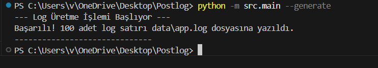
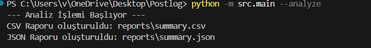
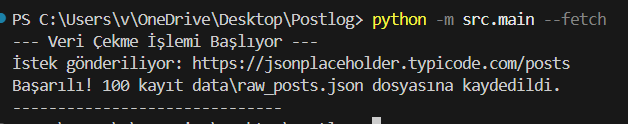
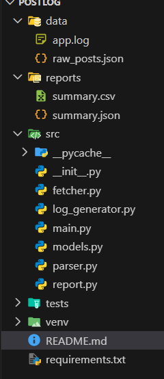

# Log Analiz ve Raporlama Aracı

Bu proje, harici bir API'den veri çeken, bu verilerden sentetik log kayıtları üreten ve oluşan logları analiz ederek raporlayan bir Python uygulamasıdır.

## Projenin Amacı
JSONPlaceholder API'sinden alınan örnek "post" verilerini kullanarak simüle edilmiş bir log dosyası oluşturmak ve bu dosyayı düzenli ifadeler (Regex) ile analiz ederek kullanıcı ve hata istatistikleri çıkarmaktır.

## Kurulum

1. Projeyi bilgisayarınıza indirin.
2. Bir sanal ortam (venv) oluşturun ve aktif edin:
   ```bash
   python -m venv venv
   # Windows için:
   venv\Scripts\activate
   # Mac/Linux için:
   source venv/bin/activate





